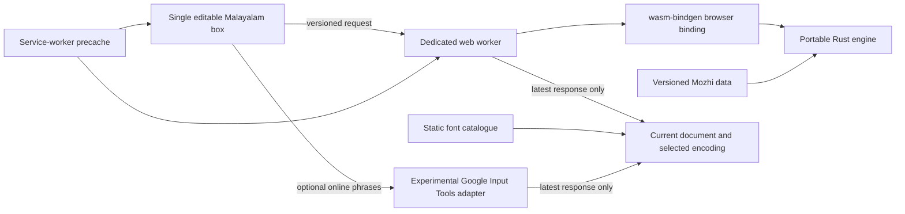

# Architecture

## Portable engine

`lipiflow-core` has no browser, filesystem, networking or UI dependencies.
Its public API is `transliterate(&str) -> String`, `ENGINE_VERSION`, and
`SCHEME_VERSION`. `encode_legacy(&str) -> Encoded` converts Unicode Malayalam
to the checked Karthika font positions and reports unsupported graphemes.
`lipiflow-wasm` exposes equivalent functions to JavaScript.

The MIT-licensed Keyman reference is frozen at keyboard version 3.2.6 and compiled
into 1,746 data rules by `scripts/compile-mozhi.mjs`. The compiler only recognizes
the reference’s limited syntax and rejects unknown expressions. It never executes
reference code. `--check` verifies generated data against the checked-in source.
Data records carry schema version, reference version and a SHA-256 source digest.

The Rust interpreter indexes rules by input key, checks the longest matching
context first, and uses source order for ties. Invisible deadkey context captures
lookbehind needed for the scheme; it is never returned as text. Full source replay
makes backspace, selection replacement and undo independent of previous results.
Existing non-ASCII text forms a preserved boundary; `{literal}` spans bypass rules.

## Browser boundary

WASM uses wasm-pack’s `web` target and asynchronous initialization in a dedicated
worker. Conversion messages are `{type:"convert",id,text}`; successful responses
are `{type:"converted",id,text}`. The same shared worker accepts `{type:"encode",id,text}`
and returns encoded text, unsupported graphemes and UTF-16 editing spans. Its source and id guards
combine with transliteration freshness to enable exports. Google candidate
changes flow through this same offline encoder. Ready messages identify versions. Error messages
carry no input text or diagnostics. Worker crashes and initialization failures
disable exports until retry succeeds.

The app debounces edits by 25 ms, suppresses requests during composition, ignores
stale response ids and checks the response’s source before enabling export.
Independent clients multiplex request IDs into one worker per page. It is
terminated when the last client leaves and recreated on startup retry. Text stays in
memory unless a user enables draft persistence.

The web-only Google adapter is isolated from Rust. It debounces 350 ms, protects
literal spans, partitions Latin phrases into at most 160-character requests,
and preserves separators and other scripts locally. Three requests can run at
once, with a 10-second conversion deadline. Cancellation plus effect cleanup
prevents older results from replacing a new edit; source matching disables export
while conversion is pending. Candidate dropdowns commit the chosen Unicode spelling into the editable document. The endpoint is undocumented, so this mode is experimental.
On browser-reported offline status, the selected Google mode visibly uses Mozhi.

## Inline editing

The browser stores a canonical Unicode document plus one active Roman insertion.
The full-text Rust API reconverts that insertion after each edit; committed Malayalam
is preserved. Pending conversion shows the active Roman text and disables export.
This is a browser editing adapter, not a native-keyboard engine API.

`InlineEditor` projects the document into the selected font encoding only after
conversion is current and the exact legacy font is loaded. Rust supplies spans
between original Unicode and encoded UTF-16 offsets, including decomposed marks
and surrogate pairs. Selection/caret edits map through those spans; interior legacy
cluster selections expand to their Unicode boundaries. Without a local legacy font,
the box renders Unicode while exports still use the selected legacy positions.

Typing at the active insertion replays its original Roman sequence, so backspace
works across conjuncts. Other edits commit the current Unicode and start a new
insertion. A bounded 200-edit in-memory history handles undo/redo and mobile
`beforeinput` history events. Composition captures its starting projection, keeps
browser-owned text untouched until composition ends, then converts once.
Optional drafts and update handoffs use versioned `lipiflow-inline/1` documents;
older plain Manglish drafts remain readable.

## Offline and updates

Vite PWA/Workbox precaches the entire static artifact including the worker and
WASM. The service worker claims clients on first activation; updates wait for the
user. Offline readiness checks active control and the critical local cache assets.
No external fonts are fetched. The optional Google endpoint is not cached;
offline readiness refers to the local app, Mozhi engine and fonts.

An accepted update stores a five-minute, one-use handoff in session storage,
activates the new worker and reloads. Startup consumes and deletes the handoff.
If the handoff cannot be stored, the app asks the user to copy/save before reloading.

## Future adapters

Keep the Rust core authoritative. UniFFI wrappers for Kotlin/Swift and direct Rust
calls from Tauri can reuse its rules. Native keyboard adapters will add word
composition, candidates, cursor and commit interfaces; the web full-text API does
not pretend to provide those interfaces yet. Verified legacy encoding belongs in
the portable core after mapping data and independent fixtures are available.

## Hosted library and admin boundary

The same web editor is built twice. `VITE_LIPIFLOW_EDITION=hosted` enables the
account and catalogue adapter; the standalone edition makes no API requests.
Vercel serves the hosted web/admin static build and its small Firebase Admin role
function. `apps/server` is a Cloudflare Worker: it verifies Firebase Auth ID tokens,
uses Firebase custom claims for roles, D1 for font catalogue/moderation/reports,
and a private R2 binding for font binaries. Firestore rules isolate profiles,
favourites, drafts and role-change audit records by account. All editions and
shared `packages/library` schemas are MIT-licensed.

The web adapter requests font bytes by ID and renders preview text locally.
Server status checks gate every asset fetch. Publishing requires an explicit
permission review; reports are private and a report resolution can hide its font
atomically with the audit entry. Firebase rules keep account records private and
prevent users from changing role claims. The server never runs transliteration or
receives preview text unless a user explicitly saves a cloud draft.

See [hosted setup and verification](HOSTED_EDITION.md).
